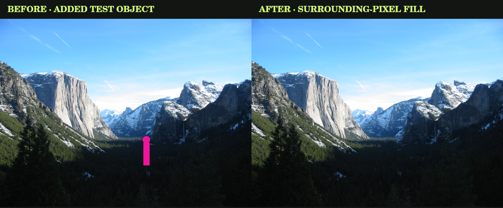

# PHOTOBENCH v1.4.0

A self-hosted, local-first photo editor from Green Shoe Garage.

**Open → Adjust → Compare → Export.**

An independent browser implementation inspired by Snapseed-style photo editing. It is not an official Snapseed port and does not use Google's code, artwork, or proprietary editing algorithms.

## Run it

**Simplest:** open `index.html` in a current desktop browser. The editor, sample image, styles, and image-processing worker are embedded. No installation, account, API key, build, or internet connection is needed.

**On your server:** create a folder such as `/photobench/` and upload these two files together:

```text
photobench/
  index.html
  sw.js
```

Visit `https://your-domain.example/photobench/`. Any ordinary static host works. Relative paths support deployment at a subdirectory. `index.html` alone runs the editor; `sw.js` adds offline page reload after a successful first visit over HTTPS or localhost.

**Local server, including macOS:** from this folder run `python3 -m http.server 8000`, then open `http://localhost:8000/`. Python is optional; opening the HTML directly also works. Browser behavior for storage on `file://` differs; a local server is the more predictable choice for recovery.

Do not upload your photos or saved project JSON files to your public web folder. The application never requires them to be on the server.

## What is included

- JPEG, PNG, and WebP import, file picker and drag/drop.
- Twelve editable looks, plus up to 24 personal looks saved in your browser.
- Exposure, brightness, contrast, highlights, shadows, whites, blacks, saturation, vibrance, warmth, tint, sharpening, and structure.
- Master RGB and individual red/green/blue tone curves, with nine editable output anchors, a draggable curve graph, and linear/smooth interpolation.
- Free and ratio crops, draggable corners/interior, optional snapping to thirds/center, exact percentage bounds, rotation, flip, and ±30° straightening.
- Horizontal/vertical perspective correction and explicit transparent, solid-color, or stretched-edge fill.
- Canvas expansion with transparent, solid, edge, or mirrored fill.
- Eight overlapping HSL color ranges with separate hue, saturation, and lightness controls.
- Up to twelve soft radial control points with exposure, saturation, and warmth.
- Painted exposure, saturation, and warmth adjustments; up to 60 strokes per project. Select, edit, bypass, or delete individual strokes; show their masks and erase portions. Optional pen pressure controls radius.
- Magic Eraser: paint unwanted objects, preview an automatic surrounding-pixel fill, retry/refine, keep, or undo.
- Soft manual clone retouching; up to 60 strokes. Select individual strokes to change size, opacity, or sampling offset; bypass or delete them.
- Halation, grunge, film palettes, dehaze, and chromatic aberration with individual strength, tuning, bypass, and reset.
- Vignette, grain, glow, radial lens blur, text, and inset frames.
- Double exposure with Normal, Screen, Multiply, Overlay, and Soft Light blending.
- Aligned original/edited comparison, luminance histogram, zoom/pan, touch pinch, Full detail preview, and undo/redo.
- Editing-group bypass inspector, session history, and up to eight named comparison/restore snapshots.
- Portable recipe JSON for global looks, with optional geometry/text/frame.
- Remembered tool, group expansion, inspector width, theme, and mode.
- JPEG, PNG, and WebP output; adjustable dimensions and quality; print/save-to-PDF through your browser.
- Easy and Advanced modes; dark, light, and high-contrast themes.
- IndexedDB autosave with visible save status, portable project JSON, and Fresh Start.
- No telemetry, advertising, account requirement, image uploads, runtime dependencies, or external fonts.

## Everyday use

1. Open a photo, or choose **Try the Yosemite sample**.
2. Pick a Look if useful. Looks replace global tone, curves, and effect settings; they leave crop, text, local adjustments, and clone work intact.
3. Use Adjust to shape tone and color. Switch to Advanced for curves, detail, and local tools. Existing advanced edits remain applied in Easy mode.
4. In Crop, draw a rectangle or select a ratio. Drag its corners to resize or its interior to move it. Choose **Apply crop** to use the draft. Leaving the Crop tab without applying discards only the draft. Rotation/flip reset crop bounds. Full Image removes a crop.
5. Compare with **Before / after**. The original tones share the current crop and orientation. Hold Space while the photo workspace has keyboard focus for a temporary comparison.
6. Export an image for use elsewhere. Download a **project JSON** to keep editing later.

Undo/redo keeps the latest 50 states in the current session. Reloading or opening a project begins a new undo history; all active editing parameters and the source photo remain available.

### Selective edits and retouching

Control points and brush strokes are stored in normalized source-image coordinates. They stay attached to the photo when you crop or rotate. The default point appears near the center of the visible crop. Use its position fields or drag its center. Masks are soft radial regions; they do not detect subjects or match colors automatically.

Brush strokes apply the chosen adjustment with a soft edge. A stroke uses its strongest brush coverage at each pixel, avoiding dark joins. Separate strokes accumulate. Undo removes a stroke; Erase All removes all adjustment brush strokes.

Clone retouching samples the source after any kept Magic Eraser repairs and before color edits. Choose a clean source, then paint over a small distraction. Each stroke uses an offset from its first point to the selected source. Re-pick the source for another area. The Clone brush copies the area you choose; Magic Eraser chooses surrounding patches automatically. At source-image edges, sample patches may contain transparent pixels.

Text and borders are added after geometry and are aligned to the final frame. The frame is inset and covers the photo edge; it does not expand the image. Text supports up to five lines and three built-in font families.

### Storage and recovery

One active project is saved in IndexedDB in this browser. The status reads Unsaved, Saving, Saved, or an explicit storage error. Saved looks, theme, and mode use localStorage. Save a project JSON for important work: browser eviction, private browsing, clearing site data, changing origins, or changing devices can remove local recovery.

Project JSON schema 4 includes the working source image, adjustments, spatial edits, Magic Eraser patches, snapshots, and every second image referenced by the current edit or a snapshot. Schema-1, schema-2, and schema-3 projects from v1.0–v1.3 import automatically; older projects start with no removal patches. Five-anchor curves are expanded to nine anchors with the original linear shape retained. New schema-4 projects require v1.4 or later so older editors cannot silently drop removal patches; keep older backups if needed. Import validates the schema, image type, ranges, mask sizes, asset identifiers, and working dimensions. Invalid imports preserve the existing session. No network URLs or imported scripts are accepted.

Fresh Start clears the active project and its autosave after confirmation. It keeps personal looks and interface preferences. Reset All Edits is undoable. Personal looks can be cleared separately from the Looks panel.

### Export and image fidelity

Fast preview starts from a source at most 1280 pixels on the longest edge; canvas expansion can increase the displayed result dimensions. Full detail uses working-resolution pixels within the output budget. Export reprocesses the source independently of preview quality, then applies the requested output size without upscaling the photo itself. Expanded canvas adds pixels around it. Input files are never overwritten.

- Inputs must be JPEG/PNG/WebP and at most 40 MB.
- Photos above 20 megapixels or 6000 pixels on either edge are reduced on import, with a visible notice. The project retains the reduced working copy; keep your original file separately.
- A project file may be up to 180 MB. Embedded PNG images and second exposures can make projects large.
- Exported images omit camera metadata, including GPS. PNG/WebP preserve available transparency; JPEG flattens it onto white.
- Processing is 8-bit browser RGB. This is not a RAW developer or a professional wide-gamut/ICC color-management system.
- Expanded output is capped at 32 megapixels and 8192 pixels per edge. When expansion exceeds that budget, the rendered source and final canvas are reduced proportionally; the export dialog shows the actual output dimensions.
- Curves offer piecewise-linear or smooth monotone Hermite interpolation. Structure and sharpening use local contrast; glow and lens blur use box-filter softening. Artistic effects are original approximations, not identical reproductions of Snapseed filters.
- Preview versus full-size grain, detail, brush edges, and blur can differ slightly with resolution. Judge final sharpness from an exported image.
- Large photos, many local strokes, and double exposure require substantial memory. Device/browser memory limits can be lower than the application's input limit. Reduce the image dimensions first on constrained phones.
- Print/PDF is an image printout using browser print settings, not a separate analysis report.

## Offline and privacy

The standalone HTML is self-contained. The only server requests made by a hosted editor are for its own page and service worker. Photos are decoded, edited, and saved on the device. A hosting provider may keep normal access logs for page visits; the application does not send image contents to it.

The service worker caches only this editor's page. Its cache name is scoped to the deployment route. Project data is not stored in the service-worker cache. Browser storage is origin-specific: instances on the same origin share the active session and saved looks. Use distinct origins if you need isolated installations.

If you enforce Content Security Policy, the standalone bundle needs inline scripts/styles, `worker-src blob:`, and `img-src data: blob:`. There are no external scripts. A restrictive server policy can block embedded workers; adjust it deliberately for this route.

## Accessibility and browser support

Controls have labels, focus outlines, keyboard input, native dialogs, and status announcements. Editing can be performed with numeric fields and sliders; spatial brush/clone painting requires a pointing device. Control points and crop have keyboard-accessible numeric alternatives. On mobile, editing controls appear beneath the photo. Preview zoom uses ordinary scrolling to inspect enlarged images.

The v1.3 baseline was tested in Chromium 134 on Linux at desktop, tablet, and phone sizes. For v1.4, the new algorithms and app integration were verified with native Canvas and real worker threads. Browser UI checks could not be rerun: a local browser executable was unavailable, its download endpoint was unavailable, and the cloud browser blocked the local test URL. Browser acceptance tests are included but unexecuted for this release. Physical iOS/Android and Safari/Firefox/Edge were not tested. Use a current browser with Canvas, Web Workers, IndexedDB, and native dialog support. Service-worker offline reload requires a secure context.

## Repository contents

| File/folder | Purpose | Upload to server? |
|---|---|---|
| `index.html` | Complete runnable editor | Yes |
| `sw.js` | Offline reload on HTTPS/localhost | Recommended |
| `src/` | Editable HTML/CSS/JS and embedded public-domain sample | No |
| `build.py` | Optional maintainer bundler, Python standard library only | No |
| `tests/` | Browser workflow regression checks | No |
| `docs/` | Architecture, roadmap, test report, release notes | No |
| `LICENSE` | GNU GPL version 3 | Keep with distribution |
| `THIRD-PARTY-NOTICES.md` | Sample photo provenance | Keep with distribution |

Users do not need to build anything. Maintainers can edit `src/`, then run `python3 build.py` to update `index.html`. Keep `VERSION`, the visible version, and the service-worker version in sync for future releases.

Developer checks use Node, Playwright, and optional native Canvas; none is a runtime dependency. See `tests/README.md` for running them. The package includes complete readable source and no minified third-party JavaScript.

## New v1.4 Magic Eraser

Open **Retouch → Magic Eraser** in Easy or Advanced mode.

1. Paint the entire unwanted object, including its shadow and a small margin around its edges. Adjust the brush radius for precision; zoom and Pan are available as before.
2. Use **Subtract mask** to remove accidentally painted areas. **Undo mask stroke** and **Clear mask** modify the selection without changing the photo. The pink overlay marks the removal area.
3. Choose **Erase object**. A local worker searches unpainted surroundings for matching patches and reconstructs the selected background. **Cancel removal** stops processing and leaves the mask available.
4. Inspect the proposed fill. **Keep result** commits it; **Try another fill** changes the candidate search; **Back to mask** discards the proposal and lets you paint or subtract more.
5. Use ordinary Undo/Redo after keeping a result. **Refine last kept removal** restores its mask and returns to the photo before that removal. **Remove last kept removal** removes it without a mask. Both actions are undoable.

**Fine-tune removal:** Surroundings controls how far beyond the selection to search; Texture patch radius controls the texture footprint used for matching. Increase Surroundings if there is not enough clean background nearby. An automatic fill never samples painted pixels as donors. No source-point picking, uploads, server, account, downloaded model, or API key is required.

**Recovery:** Mask strokes are autosaved, undoable, and included in project JSON. Kept results are PNG patches referenced by the current project and named snapshots. The original remains intact. An unkept preview is temporary; switching tools or making another edit discards that proposal while retaining the mask. Keep the result before exporting. Edits → Magic Eraser bypasses all kept removals without erasing them. Named snapshots retain their own removal patches, even after the current session is reset. Looks and recipes preserve existing spatial removals; recipes do not transfer removals to a different photograph.

**Limits:** This reconstructs a plausible background from existing pixels, not the true hidden scene. It works best on repeating textures, walls, sky, foliage, and similar backgrounds. Large objects covering unique structures, text, faces, or intersecting lines can produce repeated patterns, seams, or incorrect geometry. Paint a complete silhouette plus a margin; a partially covered object can leave a remnant. Remove separate objects one at a time. Retry, refine, or switch to Clone brush for manual cleanup.

Analysis uses a surrounding region reduced to at most 720 pixels on its longest side, then reconstructs the result from native-resolution source samples. The photograph's dimensions do not change. Very fine unique texture can differ inside the repaired area. Each project supports 32 kept removals, 60 strokes per draft mask, and 1,200 points per stroke; existing file/working-image and portable project size limits still apply. Transparent pixels remain transparent and cannot supply opaque texture. Removals apply before clone strokes, second exposure, color/effect processing, and geometry; they do not remove text, frames, expanded canvas fill, or objects that exist only in a second exposure.



The comparison above was generated by the actual application pipeline on the bundled sample with an added test object; it is not a browser screenshot or a claim that arbitrary objects always remove seamlessly.

## New v1.3 creative filters

Open **Finish → Creative filters** in either Easy or Advanced mode. All five filter names are visible at the top. Select one and move its strength from zero. Multiple filters can be combined. **Apply** temporarily bypasses only that filter while preserving its settings; **Reset** inside the filter restores only that filter. The panel-heading Reset resets all Finish settings as before. Fine-tune controls are collapsible and their open/closed state is remembered.

| Filter | Controls and behavior |
|---|---|
| Halation | Highlight-driven red/amber edge halo; strength, spread as a percentage of the shorter image side, highlight threshold, and red warmth. It leaves remote shadows alone. |
| Grunge | Deterministic procedural stains, dust, and scratches; strength, texture size, roughness, and seed. New texture advances the seed; rerendering never randomly changes the texture. |
| Film | Warm negative, Cool slide, Silver monochrome, and Faded instant palettes; strength, faded blacks, grain, and grain size. These are original artistic looks, not calibrated commercial film-stock emulations. |
| Dehaze | Positive strength removes estimated atmospheric haze; negative strength adds haze. Atmosphere scale adjusts the spatial estimate for positive strength. Start around +20 to +40. |
| Chromatic aberration | Intentional red/blue channel separation; signed strength reverses the fringe. Radial mode exposes optical center X/Y; Linear mode exposes direction. Green and alpha stay fixed. |

All new amounts default to zero. Sliders, numeric entry, undo/redo, original comparison, snapshots, autosave, saved looks, JSON projects, recipes, PNG/JPEG/WebP exports, and print use the same filter settings. The Edits → Effects bypass also bypasses the five filters. Applying a Look replaces global effects, including these filters.

Filtering occurs on the source composition before crop, perspective, text, and frame, so added text and borders remain clean. Order is fixed: dehaze → tone/color/curves/local adjustments/detail → film → existing glow/blur/vignette/grain → halation → chromatic aberration → grunge. Finish's existing Grain adds independently of Film grain.

Dehaze is a bounded, dark-channel-inspired approximation with box-smoothed transmission; it can overcorrect bright white objects or introduce halos at strong depth edges. Reduce strength for those scenes. It does not reconstruct obscured detail. Halation, film, grunge, and aberration are artistic simulations. Fast preview resamples the source, so fine grain, tiny fringes, and halo boundaries can differ slightly from export; use **Full detail** for final judgment. Full detail and full-size export match at the same working resolution.

## New v1.1 / v1.2 workflows

**Local editing:** In Selective → Brush, the upper controls configure the next stroke. Recorded Adjustments selects an existing stroke. Its radius, strength, feather, and enabled state can be changed without repainting. Show Selected Mask overlays its influence in magenta. Erase Selected Mask affects only that stroke and uses the next-stroke radius. Restore Erased Area removes that stroke's eraser paths. Up to 30 eraser paths are retained per stroke. Pressure is captured only from pen events when enabled; mouse/touch strokes retain a steady radius.

**Crop/navigation:** Corner handles resize; interior drag moves a non-full-image crop; outside drag draws another rectangle. Ratio selection is preserved during corner resizing. Snap can align crop movement/handles to image edges, thirds, and center. Pan is an explicit mode to avoid accidental brush strokes. Ctrl/Command+wheel and two-finger pinch zoom around the interaction point. Full Detail is a full-resolution preview, not a tiled viewer; use Fast on constrained devices. Inspector resizing is available on desktops wider than 1100 pixels and also supports arrow keys on its divider.

**Perspective/expansion:** Crop → Perspective corrects horizontal and vertical convergence using a projective transform. The transformed image is fitted into the existing working frame. Fill choices are explicit; nothing is invented by AI. Expansion applies around the cropped image and is visible outside the Crop tab. It adds up to 50% on each side. Masks and retouching operate on the original image; they do not paint the new fill area. A border is still inset into the final expanded frame.

**Color mixer/curves:** Adjust → Color Mixer offers Red, Orange, Yellow, Green, Aqua, Blue, Purple, and Magenta. Ranges overlap with soft weighting and protect near-neutral pixels. Curve anchors have fixed input positions every 12.5%; drag their output values or use numbers. Smooth interpolation avoids overshoot between monotonic anchors.

**Recipes:** Project → Export / Apply Recipe saves tone, curves, HSL, and effects without embedding images. Optionally include geometry or text/frame. Import previews the groups to be replaced and asks before applying. It preserves spatial edits, source photos, snapshots, and second exposures; Undo restores the previous settings. Recipe files use their own schema 2 and are limited to 1 MB. Legacy schema-1 recipes import with neutral creative-filter settings; new recipes require v1.3 or later.

**Edits/snapshots:** Edits bypasses groups while retaining their parameters. Processing order is fixed; the inspector does not reorder filters. A named snapshot freezes the full edit settings and retains its second-image reference. Compare shows that snapshot's complete composition, which may have a different crop or size; Original Tones uses the current geometry for alignment. Restoring a snapshot is undoable. Deleting a snapshot is confirmed and leaves the current edit intact. History is session-only; named snapshots persist in project JSON and autosave.

**Updating an installation:** Download a project backup, close old editor tabs, replace both `index.html` and `sw.js`, and reopen the editor. Existing schema-1, schema-2, and schema-3 autosaves are migrated on load. All copies on the same origin share one active project, so avoid editing the same session in multiple tabs.

## License and next steps

Copyright © 2026 Michael Parks / Green Shoe Garage. GNU GPL v3 only. The sample photograph is separately public domain. See `LICENSE` and `THIRD-PARTY-NOTICES.md`.

Magic Eraser is implemented in v1.4 with local exemplar-based inpainting. Batch workflows and export-queue refinement remain future work. See `docs/ROADMAP.md`. RAW/HEIC decoding, automatic subject masking, and semantic/generative reconstruction are not included.
